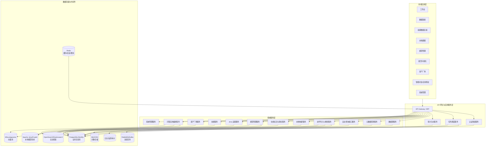
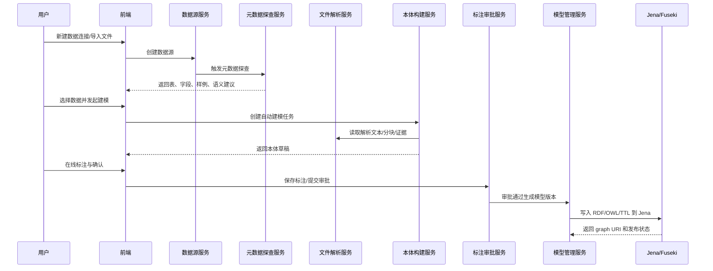
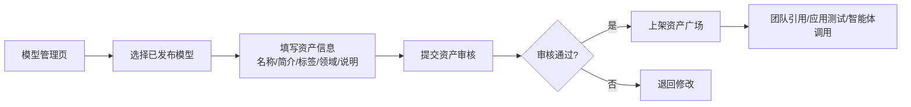
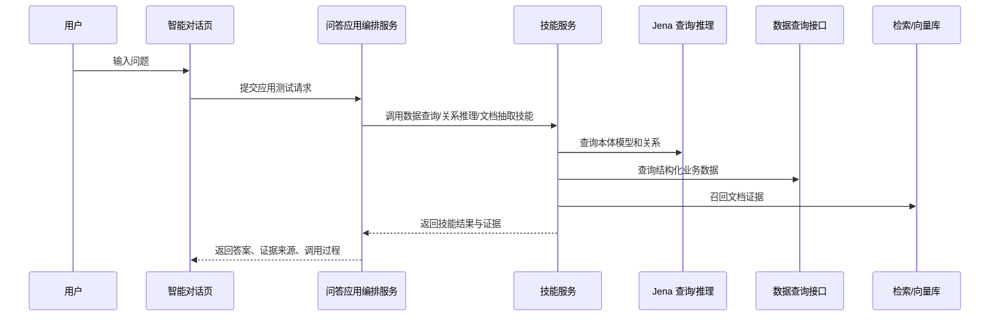
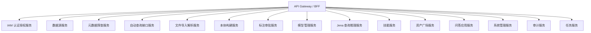
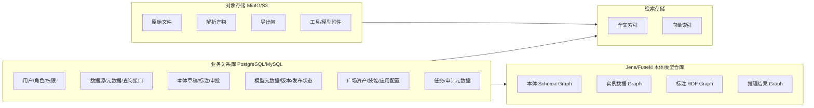
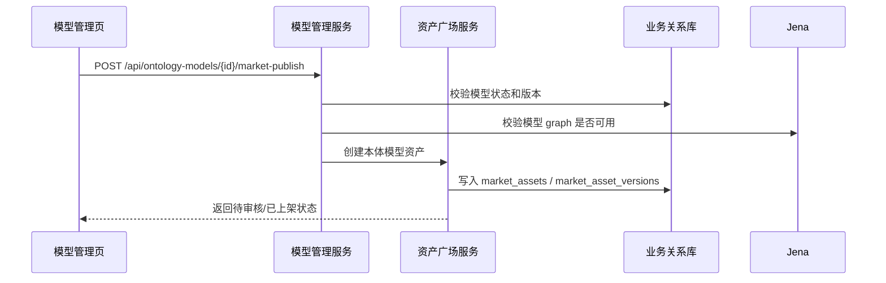

# 本体平台架构蓝图：架构图、前后端接口与数据存储

## 1. 设计目标

本文档基于最后一版 UI 原型，面向前后端研发落地，重点说明：

- 完整系统架构图。
- 前端页面与后端服务的对应关系。
- 前后端 API 接口分组。
- 数据存储设计与职责边界。
- 本体模型明确采用 **Apache Jena / Fuseki** 存储。

核心原则：

- 前端面向用户呈现“数据链接、本体建模、模型管理、模型可视化、资产广场、智能对话、系统管理”。
- 后端面向研发拆分“数据接入、本体构建、Jena 模型仓库、技能编排、资产广场、问答应用、权限审计、任务调度”。
- Jena 只作为本体/RDF 模型仓库，不作为平台业务主库。
- 平台还需要业务关系库、对象存储、全文检索、向量库、缓存、消息队列和审计日志体系。

## 2. 总体架构图



## 3. 核心业务链路图

### 3.1 数据到本体模型链路



### 3.2 模型发布到资产广场链路



### 3.3 智能对话应用测试链路



## 4. 前端模块与页面职责

| 前端页面 | 文件 | 页面职责 | 调用后端服务 |
| --- | --- | --- | --- |
| 工作台 | `index.html` | 展示数据源、模型、智能体、用户、最近活动和分布统计 | 统计服务、活动服务 |
| 数据链接 | `data.html` | 连接管理、搜索、筛选、连接列表 | 数据源服务、元数据服务 |
| 新建数据连接 | `data-new.html` | 选择连接类型、进入连接配置流程 | 数据源服务 |
| 本体建模 | `modeling.html` | 选择已有模型编辑、自动建模入口、模型选择器 | 本体构建服务、模型管理服务 |
| 自动建模 | `auto-model.html` | 输入建模要求、查看抽取结果、提交审批 | 本体构建服务、标注审批服务 |
| 模型管理 | `models.html` | 模型列表、状态统计、发布到资产广场 | 模型管理服务、资产广场服务 |
| 模型可视化 | `visualization.html` | 图谱控制、筛选、节点详情、空状态 | 模型图谱服务、Jena 查询服务 |
| 资产广场 | `marketplace.html` | 智能体、工具、技能、本体模型资源展示和使用 | 资产广场服务、技能服务 |
| 智能对话 | `chat.html` | 应用测试、问答、证据、配置 | 问答应用服务、技能服务 |
| 系统管理 | `admin.html` | 用户管理、模型管理、本地模型添加、SSO、审计 | IAM、模型管理、审计服务 |

## 5. 后端服务拆分



| 服务 | 核心职责 |
| --- | --- |
| IAM 认证授权服务 | 登录、SSO、用户、角色、权限、Token |
| 数据源服务 | 数据源创建、连接测试、连接状态、凭证加密 |
| 元数据探查服务 | Schema、表、字段、样例、主外键、字段语义建议 |
| 自动查询接口服务 | 基于数据源生成只读查询 API，执行查询，记录审计 |
| 文件导入解析服务 | 文件/文件夹导入、解析、分块、OCR、证据位置 |
| 本体构建服务 | 自动建模、草稿、概念/属性/关系/约束抽取 |
| 标注审批服务 | 在线标注、提交审批、审批流转、差异记录 |
| 模型管理服务 | 模型版本、发布状态、模型列表、发布到广场 |
| Jena 查询推理服务 | Jena 写入、SPARQL 查询、推理、named graph 管理 |
| 技能服务 | 数据查询技能、模型查询技能、关系推理技能、文档抽取技能 |
| 资产广场服务 | 智能体、工具、技能、本体模型、问答应用发布与审核 |
| 问答应用服务 | 应用测试、会话、答案、证据、调用过程、反馈 |
| 系统管理服务 | 本地模型添加、系统配置、审计日志、任务监控 |
| 任务服务 | 异步任务、任务状态、任务日志、失败重试 |

## 6. 前后端接口设计

### 6.1 通用协议

#### 统一响应

```json
{
  "code": "0",
  "message": "success",
  "data": {},
  "traceId": "req-20260623-0001"
}
```

#### 分页响应

```json
{
  "items": [],
  "page": 1,
  "pageSize": 20,
  "total": 120
}
```

#### 异步任务状态

```json
{
  "jobId": "job_001",
  "status": "RUNNING",
  "progress": 68,
  "message": "正在解析文件",
  "createdAt": "2026-06-23T10:00:00Z"
}
```

### 6.2 工作台接口

| 方法 | 路径 | 说明 |
| --- | --- | --- |
| GET | `/api/dashboard/summary` | 获取数据源、模型、智能体、用户统计 |
| GET | `/api/dashboard/activities` | 获取最近活动 |
| GET | `/api/dashboard/data-source-distribution` | 获取数据源类型分布 |
| GET | `/api/dashboard/latest-models` | 获取最新本体模型 |

### 6.3 数据链接接口

| 方法 | 路径 | 说明 |
| --- | --- | --- |
| GET | `/api/data-connectors/types` | 获取支持的数据连接类型 |
| POST | `/api/data-sources` | 创建数据源 |
| GET | `/api/data-sources` | 查询数据源列表 |
| GET | `/api/data-sources/{id}` | 获取数据源详情 |
| POST | `/api/data-sources/{id}/test` | 测试连接 |
| POST | `/api/data-sources/{id}/profile` | 主动探查元数据 |
| GET | `/api/data-sources/{id}/metadata` | 获取元数据探查结果 |
| POST | `/api/data-sources/{id}/query-apis` | 生成数据查询接口 |
| GET | `/api/query-apis` | 查询已生成的数据查询接口 |
| POST | `/api/query-apis/{id}/execute` | 执行数据查询接口 |
| DELETE | `/api/data-sources/{id}` | 删除数据源 |

### 6.4 非结构化文件解析接口

| 方法 | 路径 | 说明 |
| --- | --- | --- |
| POST | `/api/files/import` | 导入文件、文件夹、压缩包 |
| GET | `/api/import-jobs/{jobId}` | 查询导入任务状态 |
| GET | `/api/documents` | 查询文档列表 |
| GET | `/api/documents/{id}` | 获取文档详情 |
| GET | `/api/documents/{id}/chunks` | 获取文档分块 |
| POST | `/api/documents/{id}/reparse` | 重新解析文档 |
| DELETE | `/api/documents/{id}` | 删除文档 |

### 6.5 本体建模接口

| 方法 | 路径 | 说明 |
| --- | --- | --- |
| POST | `/api/ontology-build-jobs` | 创建自动建模任务 |
| GET | `/api/ontology-build-jobs/{jobId}` | 查询建模任务状态 |
| GET | `/api/ontology-drafts` | 查询草稿列表 |
| GET | `/api/ontology-drafts/{draftId}` | 获取草稿详情 |
| PATCH | `/api/ontology-drafts/{draftId}/items/{itemId}` | 修改草稿候选项 |
| POST | `/api/ontology-drafts/{draftId}/validate` | 校验草稿质量 |
| POST | `/api/ontology-drafts/{draftId}/submit` | 提交审批 |

### 6.6 在线标注与审批接口

| 方法 | 路径 | 说明 |
| --- | --- | --- |
| POST | `/api/annotations` | 创建标注 |
| PATCH | `/api/annotations/{id}` | 修改标注 |
| DELETE | `/api/annotations/{id}` | 删除标注 |
| GET | `/api/approvals` | 查询审批列表 |
| GET | `/api/approvals/{id}` | 获取审批详情 |
| POST | `/api/approvals/{id}/approve` | 审批通过 |
| POST | `/api/approvals/{id}/reject` | 审批驳回 |

### 6.7 模型管理与发布接口

| 方法 | 路径 | 说明 |
| --- | --- | --- |
| GET | `/api/ontology-models` | 查询本体模型列表 |
| POST | `/api/ontology-models` | 创建本体模型 |
| GET | `/api/ontology-models/{id}` | 获取模型详情 |
| PATCH | `/api/ontology-models/{id}` | 更新模型元信息 |
| POST | `/api/ontology-models/{id}/publish` | 发布模型版本并写入 Jena |
| GET | `/api/ontology-models/{id}/versions` | 查询模型版本 |
| POST | `/api/ontology-models/{id}/market-publish` | 发布模型到资产广场 |
| POST | `/api/ontology-models/{id}/market-update` | 更新广场中的模型资产 |
| DELETE | `/api/ontology-models/{id}` | 删除模型 |

### 6.8 Jena 查询与推理接口

> 本体模型采用 Jena 存储。后端对 Jena 做服务封装，前端不直接调用 Jena/Fuseki。

| 方法 | 路径 | 说明 |
| --- | --- | --- |
| POST | `/api/jena/models/{modelId}/write` | 将已发布模型写入 Jena named graph |
| GET | `/api/jena/models/{modelId}/graphs` | 查询模型对应的 graph 信息 |
| POST | `/api/jena/query` | 执行受控 SPARQL 查询 |
| POST | `/api/jena/construct` | 执行 CONSTRUCT 查询 |
| POST | `/api/jena/reason` | 执行推理 |
| POST | `/api/jena/reasoning-jobs` | 创建异步推理任务 |
| GET | `/api/jena/reasoning-jobs/{jobId}` | 查询推理任务状态 |

### 6.9 模型可视化接口

| 方法 | 路径 | 说明 |
| --- | --- | --- |
| GET | `/api/ontology-models/{id}/graph/summary` | 获取图谱摘要 |
| GET | `/api/ontology-models/{id}/graph/subgraph` | 获取局部子图 |
| GET | `/api/ontology-models/{id}/nodes/{nodeId}` | 获取节点详情 |
| GET | `/api/ontology-models/{id}/quality` | 获取模型质量检查结果 |

### 6.10 资产广场接口

| 方法 | 路径 | 说明 |
| --- | --- | --- |
| GET | `/api/market/assets` | 查询广场资产 |
| POST | `/api/market/assets` | 创建广场资产 |
| GET | `/api/market/assets/{id}` | 获取资产详情 |
| POST | `/api/market/assets/{id}/submit-review` | 提交审核 |
| POST | `/api/market/assets/{id}/approve` | 审核通过 |
| POST | `/api/market/assets/{id}/install` | 安装/引用资产 |
| POST | `/api/market/assets/{id}/unpublish` | 下架资产 |

### 6.11 技能接口

| 方法 | 路径 | 说明 |
| --- | --- | --- |
| GET | `/api/skills` | 查询技能列表 |
| POST | `/api/skills` | 注册技能 |
| GET | `/api/skills/{id}` | 获取技能详情 |
| POST | `/api/skills/{id}/test` | 测试技能 |
| POST | `/api/skills/{id}/execute` | 执行技能 |
| GET | `/api/skills/{id}/runs` | 查询技能运行记录 |

### 6.12 智能对话/应用测试接口

| 方法 | 路径 | 说明 |
| --- | --- | --- |
| POST | `/api/apps` | 创建问答应用 |
| GET | `/api/apps` | 查询应用列表 |
| GET | `/api/apps/{id}` | 获取应用配置 |
| PATCH | `/api/apps/{id}` | 更新应用配置 |
| POST | `/api/apps/{id}/test-chat` | 应用测试问答 |
| GET | `/api/apps/{id}/sessions` | 查询应用会话 |
| POST | `/api/chat/sessions/{sessionId}/feedback` | 提交问答反馈 |
| POST | `/api/apps/{id}/publish-to-market` | 发布问答应用到资产广场 |

### 6.13 系统管理接口

| 方法 | 路径 | 说明 |
| --- | --- | --- |
| GET | `/api/users` | 查询用户 |
| POST | `/api/users` | 新增用户 |
| PATCH | `/api/users/{id}` | 更新用户 |
| GET | `/api/roles` | 查询角色 |
| POST | `/api/roles` | 新增角色 |
| PATCH | `/api/roles/{id}/permissions` | 更新角色权限 |
| GET | `/api/sso/config` | 获取 SSO 配置 |
| PATCH | `/api/sso/config` | 更新 SSO 配置 |
| POST | `/api/local-models` | 在线添加本地模型 |
| GET | `/api/local-models` | 查询本地模型 |
| POST | `/api/local-models/{id}/test` | 测试本地模型连接 |
| GET | `/api/audit-logs` | 查询审计日志 |

## 7. 数据存储设计

### 7.1 存储总览



### 7.2 业务关系库

保存平台强事务元数据。

| 表 | 说明 |
| --- | --- |
| `users` | 用户 |
| `roles` | 角色 |
| `permissions` | 权限 |
| `workspaces` | 工作空间/租户 |
| `data_sources` | 数据源 |
| `data_source_credentials` | 加密连接凭证 |
| `metadata_catalogs` | 元数据探查结果 |
| `query_apis` | 自动查询接口定义 |
| `query_audit_logs` | 查询审计 |
| `documents` | 文档记录 |
| `document_chunks` | 文档分块元数据 |
| `parse_jobs` | 解析任务 |
| `ontology_build_jobs` | 自动建模任务 |
| `ontology_drafts` | 本体草稿 |
| `ontology_draft_items` | 草稿概念、属性、关系、约束 |
| `annotations` | 在线标注 |
| `approvals` | 审批记录 |
| `ontology_models` | 本体模型元信息 |
| `ontology_model_versions` | 模型版本 |
| `jena_graphs` | 模型版本与 Jena graph 映射 |
| `skills` | 技能定义 |
| `skill_runs` | 技能运行记录 |
| `market_assets` | 广场资产 |
| `market_asset_versions` | 广场资产版本 |
| `apps` | 问答应用配置 |
| `chat_sessions` | 会话 |
| `chat_messages` | 消息 |
| `app_feedback` | 问答反馈 |
| `local_models` | 本地模型配置 |
| `audit_logs` | 审计日志 |

### 7.3 Jena 模型仓库

本体模型采用 Jena/Fuseki 存储。建议每个模型版本拆分 named graph：

```text
urn:ontohub:ontology:{modelId}:{version}:schema
urn:ontohub:ontology:{modelId}:{version}:instances
urn:ontohub:ontology:{modelId}:{version}:annotations
urn:ontohub:ontology:{modelId}:{version}:inferred
```

| Graph | 内容 |
| --- | --- |
| `schema` | Class、ObjectProperty、DatatypeProperty、Restriction、Ontology metadata |
| `instances` | 实例数据、实体关系、字段映射后的实例三元组 |
| `annotations` | 标注来源、证据位置、人工确认记录的 RDF 表示 |
| `inferred` | 推理物化结果，可按需生成 |

Jena 写入来源：

- 审批通过的本体草稿。
- 结构化数据映射生成的实例关系。
- 非结构化抽取后确认的概念和关系。
- 在线标注产生的证据和标注 RDF。
- 推理任务产生的 inferred graph。

### 7.4 对象存储

| 路径示例 | 内容 |
| --- | --- |
| `/raw/{workspaceId}/{documentId}` | 原始上传文件 |
| `/parsed/{documentId}/chunks.json` | 解析分块结果 |
| `/parsed/{documentId}/tables.json` | 表格抽取结果 |
| `/exports/{modelId}/{version}.ttl` | 模型导出文件 |
| `/market/{assetId}/attachments` | 广场资产附件 |
| `/tools/{toolId}/package` | 工具配置包 |

### 7.5 全文检索与向量库

| 存储 | 内容 | 使用场景 |
| --- | --- | --- |
| OpenSearch/Elasticsearch | 文档分块文本、字段说明、资产搜索索引 | 关键词检索、证据召回、广场搜索 |
| Milvus/pgvector/ES Vector | 文档向量、概念向量、问题向量 | 语义检索、RAG、相似概念推荐 |

### 7.6 Redis 与消息队列

| 组件 | 内容 |
| --- | --- |
| Redis | 登录态、短期会话、任务进度、热点模型摘要、接口限流 |
| RabbitMQ/Kafka/Redis Stream | 元数据探查、文件解析、自动建模、模型发布、推理预计算、广场审核事件 |

## 8. 模型发布到资产广场的数据流



## 9. 研发落地顺序

1. 基础工程：用户、权限、API 网关、业务库、任务框架、对象存储。
2. 数据链接：数据源类型、连接配置、连接测试、元数据探查、查询接口生成。
3. 文件解析：文件/文件夹导入、解析任务、分块、检索和向量入库。
4. 本体建模：自动建模草稿、在线标注、审批。
5. Jena 仓库：模型发布写入 Jena、查询、推理、图谱摘要。
6. 模型管理：模型列表、版本、发布状态、发布到资产广场。
7. 资产广场：智能体、工具、技能、本体模型、问答应用资产。
8. 智能对话：应用测试、技能编排、证据、调用过程、反馈。
9. 系统管理：SSO、角色权限、审计、本地模型添加。

## 10. 关键边界说明

- 本体模型、RDF 三元组、推理结果：存储在 Jena。
- 平台用户、权限、审批、任务、广场资产、应用配置：存储在业务关系库。
- 原始文件、解析产物、导出包：存储在对象存储。
- 文档检索与证据召回：依赖全文检索和向量库。
- 耗时操作：全部通过消息队列异步执行。
- 前端不直接访问 Jena，必须通过后端 Jena 查询推理服务。
